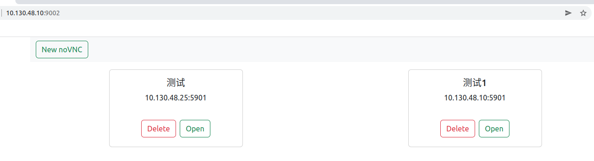
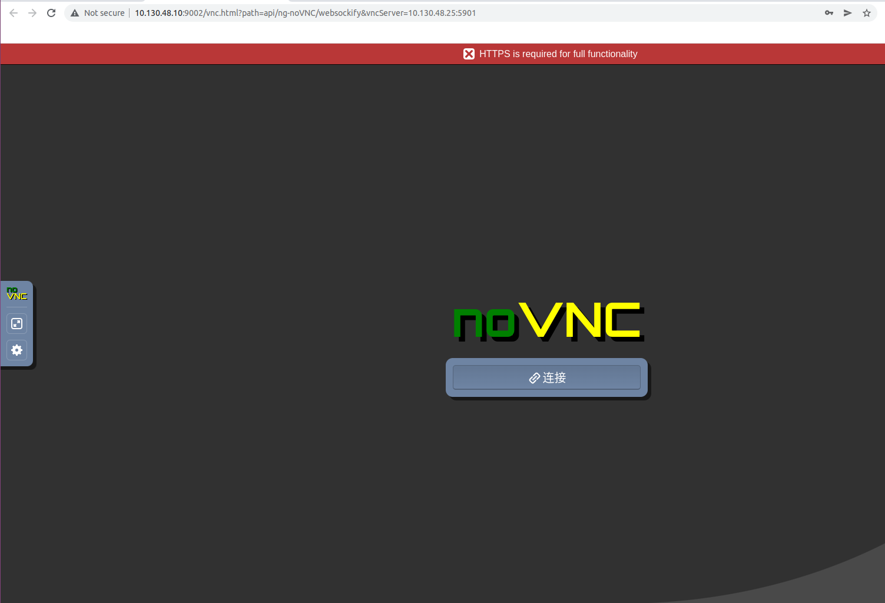
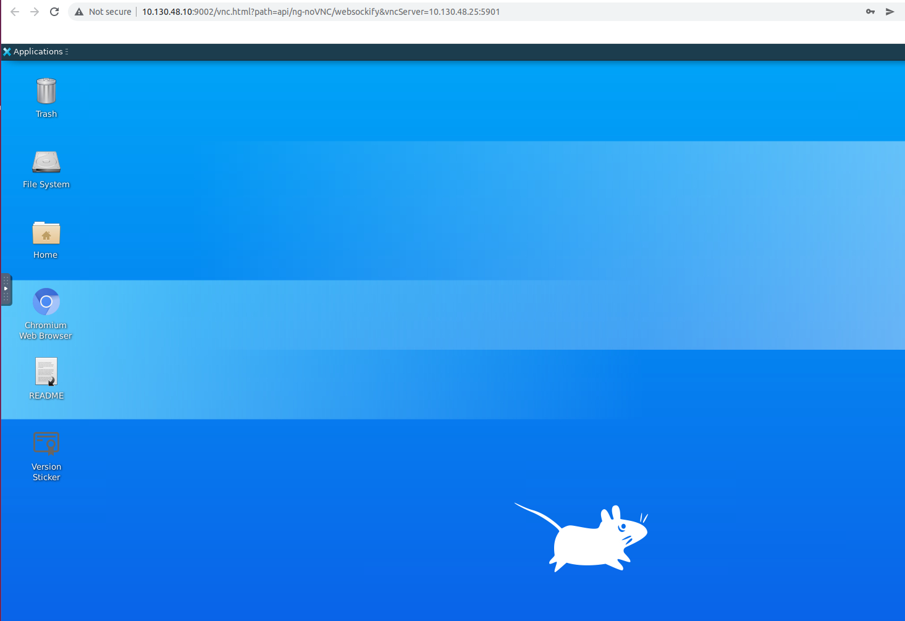

# noVNC-go

noVNC-go 是对[noVNC](https://github.com/novnc/noVNC) 的简单封装，使用go简单实现[websockify](https://github.com/novnc/websockify) ，简化了noVNC的部署，更加易用。

## Features

- 支持多vnc 客户端。
- 将noVNC和websockify合并，简化部署。

## Installation

编译:

```plaintext
git clone https://github.com/wanglu119/noVNC-go.git
cd noVNC-go
make
```

运行:

```plaintext
cd noVNC-go
./bin/noVNC-go
```

http的默认端口为: 9002

命令参数:

```plaintext
./bin/noVNC-go -h
noVNC-go

Usage:
  noVNC-go [flags]

Flags:
      --api-port uint32   api port (default 9002)
  -h, --help              help for noVNC-go

```

## Screenshots



点击"New noVNC" 创建vnc。

点击"Open"打开对应的vnc。



点击"连接"进入桌面。


